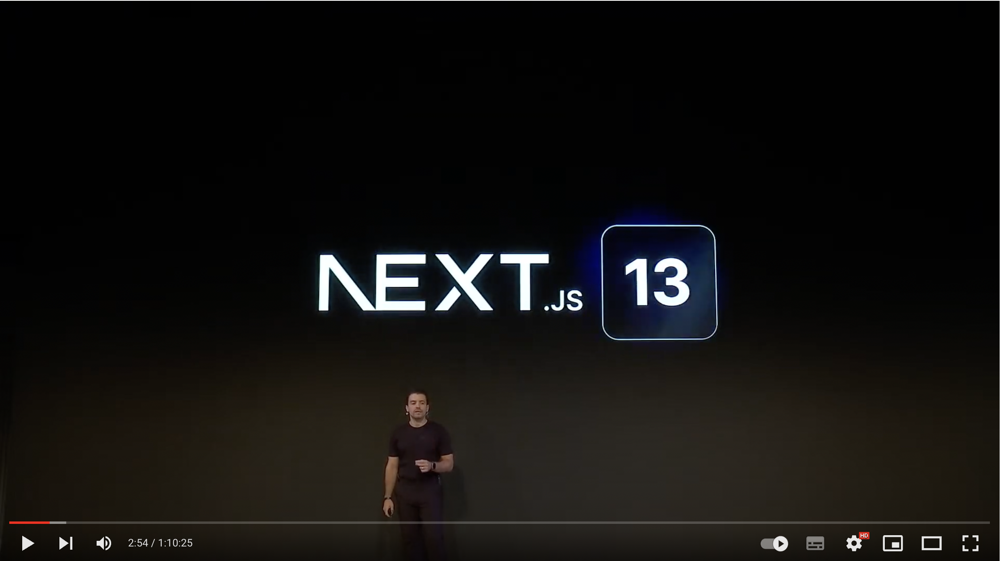

# Learn Modern Web Development using Next.js 13 in Baby Steps

Next.js Conf Keynote Announcing Version 13 :

[The Future of the Web: From Cloud to Edge](https://www.youtube.com/watch?v=HlXLVb3QCvQ)

### [Next.js 13 Beta Docs](https://beta.nextjs.org/docs/getting-started)

The stack used in this learning repo, it is a mixture of [Jamstack](https://jamstack.org/) and [T3](https://create.t3.gg/) Stacks:
[TypeScript](https://www.typescriptlang.org/),
[Next.js 13](https://nextjs.org/blog/next-13),
[Chakra UI](https://chakra-ui.com/),
[tRPC](https://trpc.io/),
[Prisma](https://www.prisma.io/),
[Strapi](https://strapi.io/),
[CockroachDB serverless](https://www.cockroachlabs.com/blog/announcing-cockroachdb-serverless/) (SQL), and [MongoDB Atlas](https://www.mongodb.com/atlas/database) (NoSQL).

This repo is part of the [Certified Web 3.0 and Metaverse Developer Training Program](https://www.panaverse.co/)

Before start learning from this repo, [learn TypeScript](https://github.com/panacloud-modern-global-apps/learn-typescript) and by doing these [TypeScript Node.js Projects](https://github.com/panacloud-modern-global-apps/chakra-nextjs-projects)

After completing this repo you should move to these specialized Web 3 learning repos:

[Next Dapps Learning Repo](https://github.com/panacloud-modern-global-apps/dapps-nextjs)

[Smart Contract Development Repo](https://github.com/panacloud-modern-global-apps/defi-dapps-solidity-smart-contracts)

Learn Chakra UI by doing Projects:

[Chakra UI Next Projects Repo](https://github.com/panacloud-modern-global-apps/chakra-nextjs-projects)
